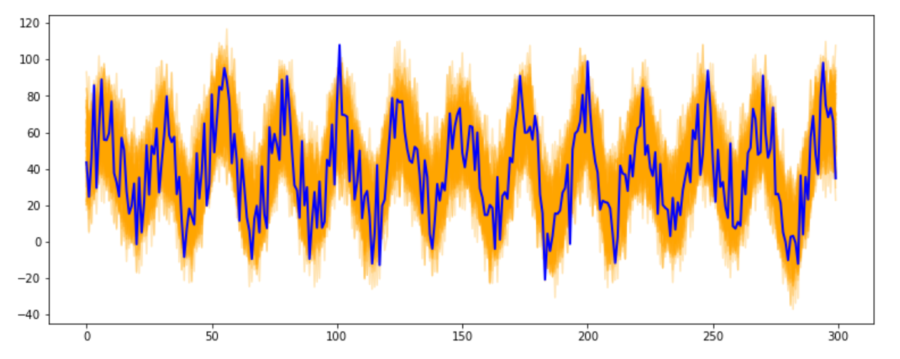

# 时间序列

- **参考网址** （资源整合网址）

[https://zhuanlan.zhihu.com/p/396504683](https://zhuanlan.zhihu.com/p/396504683)

[https://zhuanlan.zhihu.com/p/385094015](https://zhuanlan.zhihu.com/p/385094015)

[https://analyticsindiamag.com/top-10-python-tools-for-time-series-analysis/](https://analyticsindiamag.com/top-10-python-tools-for-time-series-analysis/)

[https://machinelearningmastery.com/time-series-forecasting-methods-in-python-cheat-sheet/](https://machinelearningmastery.com/time-series-forecasting-methods-in-python-cheat-sheet/)

[https://github.com/MaxBenChrist/awesome_time_series_in_python](https://github.com/MaxBenChrist/awesome_time_series_in_python)


|package name|标签|bref introduction|
|---|---|---|
|[Arrow](#Arrow)|时间格式修改|方便修改时间表示形式|
|[Featuretools](#Featuretools)|自动特征工程|固定特征模板，不一定有业务意义|
|[TSFRESH](#Featuretools)|自动特征工程|自动抽取时间序列特征|
|[PyFlux](#PyFlux)|模型,传统模型|传统的时间序列模型|
|[TimeSynth](#TimeSynth)|模拟数据|用于模拟时间序列的生成|
|[Sktime](#Sktime)|模型,机器学习|类sklearn调佣方式的时间序列处理器，**模型偏机器学习** |
|[Darts](#Darts)|模型,传统模型|传统模型到深度学习模型都有，|
|[Orbit](#Orbit)|模型,贝叶斯|**贝叶斯模型** ，Uber出品|
|[AutoTS](#AutoTS)|模型,深度学习,AutoML|**自动化** 测试**多种模型** 并给出预测结果，包括深度学习|
|[Prophet](#Prophet)|模型,季节性特征|facebook的开源时间序列处理，适合**有季节性** 的数据|
|[AtsPy](#AtsPy)|模型,深度学习,传统模型|自动化实现多个模型，传统及深度学习|
|[kats](#kats)|模型|传统模型及facebook自己的模型，深度学习暂时少|
|[gluon-ts](#gluon-ts)|模型,深度学习|**亚马逊** 的包，基于**MXNET** ，深度学习模型多|
|[AutoGluon](#AutoGluon)|模型,AutoML,深度学习|亚马逊的包，基于MXNET，AutoML，文本、图像、表格数据都可以。|
|[GENDIS](#AutoGluon)|模型,shaplet|shaplet构建距离特征，进行分类|
|[Flow Forecast](#Flow Forecast)|模型,深度学习|深度学习为主，pytorch框架，都是常见STOA模型|
|[pandas-ta](#pandas-ta)|quant,特征工程|**技术指标** 计算，基于ta-lib搭建|
|[PyTorch_Forecasting](#PyTorch_Forecasting)|模型,深度学习|将时间序列的STOA模型基于pytorch实现|
|[statsmodels](#statsmodels)|模型,传统模型|基于scipy，传统的时间序列模型，模型很全|
|[stumpy](#stumpy)|特征工程|用于构造时间序列的特征，能够为某一个特定的时间序列构造特征向量。|
|[TA-Lib](#TA-Lib)|quant,特征工程|**技术指标** 计算|
|[ta](#TA-Lib)|quant,特征工程|**技术指标** 计算|
|[tslearn](#tslearn)|模型,传统模型|传统的模型，类似sklearn的处理方法。|
|[tsmoothie](#tsmoothie)|数据预处理，模型|用于对时间序列进行平滑，去除异常点。|
| | | |


## **tsmoothie** 

### Description

用于对时间序列进行平滑，去除异常点。

> A python library for time-series smoothing and outlier detection in a vectorized way.




数据预处理目的:

*   [Time Series Smoothing for better Clustering](https://towardsdatascience.com/time-series-smoothing-for-better-clustering-121b98f308e8)
*   [Time Series Smoothing for better Forecasting](https://towardsdatascience.com/time-series-smoothing-for-better-forecasting-7fbf10428b2)
*   [Real-Time Time Series Anomaly Detection](https://towardsdatascience.com/real-time-time-series-anomaly-detection-981cf1e1ca13)
*   [Extreme Event Time Series Preprocessing](https://towardsdatascience.com/extreme-event-time-series-preprocessing-90aa59d5630c)
*   [Time Series Bootstrap in the age of Deep Learning](https://towardsdatascience.com/time-series-bootstrap-in-the-age-of-deep-learning-b98aa2aa32c4)

### installation

```Bash
pip install --upgrade tsmoothie
```


### document

[https://github.com/cerlymarco/tsmoothie](https://github.com/cerlymarco/tsmoothie)


## **tslearn** 

### Description

传统的模型，类似sklearn的处理方法。

#### 功能包括：

|data|processing|clustering|classification|regression|metrics|
|---|---|---|---|---|---|
|[UCR Datasets](https://tslearn.readthedocs.io/en/stable/gen_modules/tslearn.datasets.html#module-tslearn.datasets)|[Scaling](https://tslearn.readthedocs.io/en/stable/gen_modules/tslearn.preprocessing.html#module-tslearn.preprocessing)|[TimeSeriesKMeans](https://tslearn.readthedocs.io/en/stable/gen_modules/clustering/tslearn.clustering.TimeSeriesKMeans.html#tslearn.clustering.TimeSeriesKMeans)|[KNN Classifier](https://tslearn.readthedocs.io/en/stable/gen_modules/neighbors/tslearn.neighbors.KNeighborsTimeSeriesClassifier.html#tslearn.neighbors.KNeighborsTimeSeriesClassifier)|[KNN Regressor](https://tslearn.readthedocs.io/en/stable/gen_modules/neighbors/tslearn.neighbors.KNeighborsTimeSeriesRegressor.html#tslearn.neighbors.KNeighborsTimeSeriesRegressor)|[Dynamic Time Warping](https://tslearn.readthedocs.io/en/stable/gen_modules/metrics/tslearn.metrics.dtw.html#tslearn.metrics.dtw)|
|[Generators](https://tslearn.readthedocs.io/en/stable/gen_modules/tslearn.generators.html#module-tslearn.generators)|[Piecewise](https://tslearn.readthedocs.io/en/stable/gen_modules/tslearn.piecewise.html#module-tslearn.piecewise)|[KShape](https://tslearn.readthedocs.io/en/stable/gen_modules/clustering/tslearn.clustering.KShape.html#tslearn.clustering.KShape)|[TimeSeriesSVC](https://tslearn.readthedocs.io/en/stable/gen_modules/svm/tslearn.svm.TimeSeriesSVC.html#tslearn.svm.TimeSeriesSVC)|[TimeSeriesSVR](https://tslearn.readthedocs.io/en/stable/gen_modules/svm/tslearn.svm.TimeSeriesSVR.html#tslearn.svm.TimeSeriesSVR)|[Global Alignment Kernel](https://tslearn.readthedocs.io/en/stable/gen_modules/metrics/tslearn.metrics.gak.html#tslearn.metrics.gak)|
|Conversion([1](https://tslearn.readthedocs.io/en/stable/gen_modules/tslearn.utils.html#module-tslearn.utils), [2](https://tslearn.readthedocs.io/en/stable/integration_other_software.html))| |[KernelKmeans](https://tslearn.readthedocs.io/en/stable/gen_modules/clustering/tslearn.clustering.KernelKMeans.html#tslearn.clustering.KernelKMeans)|[LearningShapelets](https://tslearn.readthedocs.io/en/stable/gen_modules/shapelets/tslearn.shapelets.LearningShapelets.html)|[MLP](https://tslearn.readthedocs.io/en/stable/gen_modules/tslearn.neural_network.html#module-tslearn.neural_network)|[Barycenters](https://tslearn.readthedocs.io/en/stable/gen_modules/tslearn.barycenters.html#module-tslearn.barycenters)|
| | | |[Early Classification](https://tslearn.readthedocs.io/en/stable/gen_modules/tslearn.early_classification.html#module-tslearn.early_classification)| |[Matrix Profile](https://tslearn.readthedocs.io/en/stable/gen_modules/tslearn.matrix_profile.html#module-tslearn.matrix_profile)|


### installation

There are different alternatives to install tslearn:

*   PyPi: `python -m pip install tslearn<br />`
*   Conda: `conda install -c conda-forge tslearn<br />`
*   Git: `python -m pip install https://github.com/tslearn-team/tslearn/archive/main.zip`

### document

[https://github.com/tslearn-team/tslearn](https://github.com/tslearn-team/tslearn)


## **ta** 

### Description

用于技术指标的计算。

- 可以计算的技术指标

#### Volume

- Money Flow Index (MFI)

- Accumulation/Distribution Index (ADI)

- On-Balance Volume (OBV)

- Chaikin Money Flow (CMF)

- Force Index (FI)

- Ease of Movement (EoM, EMV)

- Volume-price Trend (VPT)

- Negative Volume Index (NVI)

- Volume Weighted Average Price (VWAP)

#### Volatility

- Average True Range (ATR)

- Bollinger Bands (BB)

- Keltner Channel (KC)

- Donchian Channel (DC)

- Ulcer Index (UI)

#### Trend

- Simple Moving Average (SMA)

- Exponential Moving Average (EMA)

- Weighted Moving Average (WMA)

- Moving Average Convergence Divergence (MACD)

- Average Directional Movement Index (ADX)

- Vortex Indicator (VI)

- Trix (TRIX)

- Mass Index (MI)

- Commodity Channel Index (CCI)

- Detrended Price Oscillator (DPO)

- KST Oscillator (KST)

- Ichimoku Kinkō Hyō (Ichimoku)

- Parabolic Stop And Reverse (Parabolic SAR)

- Schaff Trend Cycle (STC)

#### Momentum

- Relative Strength Index (RSI)

- Stochastic RSI (SRSI)

- True strength index (TSI)

- Ultimate Oscillator (UO)

- Stochastic Oscillator (SR)

- Williams %R (WR)

- Awesome Oscillator (AO)

- Kaufman's Adaptive Moving Average (KAMA)

- Rate of Change (ROC)

- Percentage Price Oscillator (PPO)

- Percentage Volume Oscillator (PVO)

#### Others

- Daily Return (DR)

- Daily Log Return (DLR)

- Cumulative Return (CR)

### installation

```Bash
pip install --upgrade ta
```


### document

[https://github.com/bukosabino/ta](https://github.com/bukosabino/ta)

[https://technical-analysis-library-in-python.readthedocs.io/en/latest/](https://technical-analysis-library-in-python.readthedocs.io/en/latest/)


## **TA-Lib** 

### Description

用于计算金融时间序列的各项指标。

```Bash
from talib import abstract

# directly
SMA = abstract.SMA

# or by name
SMA = abstract.Function('sma')
```


### installation

安装问题参考：

[https://github.com/mrjbq7/ta-lib](https://github.com/mrjbq7/ta-lib)

```Bash
You can install from PyPI:

$ pip install TA-Lib
Or checkout the sources and run `setup.py` yourself:

$ python [setup.py](http://setup.py) install


It also appears possible to install via [Conda Forge](https://anaconda.org/conda-forge/ta-lib):

$ conda install -c conda-forge ta-lib
```


### document

[https://github.com/mrjbq7/ta-lib](https://github.com/mrjbq7/ta-lib)


## **stumpy** 

### Description

用于构造时间序列的特征，能够为某一个特定的时间序列构造特征向量。

特征向量含义：[https://stumpy.readthedocs.io/en/latest/Tutorial_The_Matrix_Profile.html](https://stumpy.readthedocs.io/en/latest/Tutorial_The_Matrix_Profile.html)

### installation

```Bash
python -m pip install stumpy
```


```Bash
conda install -c conda-forge stumpy
```


### document

[https://github.com/TDAmeritrade/stumpy](https://github.com/TDAmeritrade/stumpy)

[https://stumpy.readthedocs.io/en/latest/Tutorial_The_Matrix_Profile.html](https://stumpy.readthedocs.io/en/latest/Tutorial_The_Matrix_Profile.html)


## **statsmodels ** 

### **Description** 

基于scipy，传统的时间序列模型，模型很全

> Contains a submodule for classical time series models and hypothesis tests


### installation

[https://www.statsmodels.org/dev/install.html](https://www.statsmodels.org/dev/install.html)

```Bash
pip install statsmodels
```


```Bash
conda install -c conda-forge statsmodels
```


### document

[https://www.statsmodels.org/devel/](https://www.statsmodels.org/devel/)

[https://github.com/statsmodels/statsmodels#documentation](https://github.com/statsmodels/statsmodels#documentation)


## **PyTorch_Forecasting** 

### Description

将时间序列的STOA模型基于pytorch实现

> *PyTorch Forecasting*  is a PyTorch-based package for forecasting time series with state-of-the-art network architectures. It provides **a high-level API for training networks**  on pandas data frames and leverages [PyTorch Lightning](https://pytorch-lightning.readthedocs.io/) for scalable training on (multiple) GPUs, CPUs and for automatic logging.


#### 适用模型：

[https://github.com/jdb78/pytorch-forecasting#available-models](https://github.com/jdb78/pytorch-forecasting#available-models)

|Name|Covariates|Multiple targets|Regression|Classification|Probabilistic|Uncertainty|Interactions between series|Flexible history length|Cold-start|Required computational resources (1-5, 5=most)|
|---|---|---|---|---|---|---|---|---|---|---|
|[RecurrentNetwork](https://pytorch-forecasting.readthedocs.io/en/latest/api/pytorch_forecasting.models.rnn.RecurrentNetwork.html#pytorch_forecasting.models.rnn.RecurrentNetwork)|x|x|x| | | | |x| |2|
|[DecoderMLP](https://pytorch-forecasting.readthedocs.io/en/latest/api/pytorch_forecasting.models.mlp.DecoderMLP.html#pytorch_forecasting.models.mlp.DecoderMLP)|x|x|x|x| |x| |x|x|1|
|[NBeats](https://pytorch-forecasting.readthedocs.io/en/latest/api/pytorch_forecasting.models.nbeats.NBeats.html#pytorch_forecasting.models.nbeats.NBeats)| | |x| | | | | | |1|
|[DeepAR](https://pytorch-forecasting.readthedocs.io/en/latest/api/pytorch_forecasting.models.deepar.DeepAR.html#pytorch_forecasting.models.deepar.DeepAR)|x|x|x| |x|x| |x| |3|
|[TemporalFusionTransformer](https://pytorch-forecasting.readthedocs.io/en/latest/api/pytorch_forecasting.models.temporal_fusion_transformer.TemporalFusionTransformer.html#pytorch_forecasting.models.temporal_fusion_transformer.TemporalFusionTransformer)|x|x|x|x| |x| |x|x|4|


### installation

```Bash
pip install pytorch-forecasting
# 或者
conda install pytorch-forecasting pytorch -c pytorch>=1.7 -c conda-forge

```


### document

[https://github.com/jdb78/pytorch-forecasting](https://github.com/jdb78/pytorch-forecasting)

[https://pytorch-forecasting.readthedocs.io/en/latest/](https://pytorch-forecasting.readthedocs.io/en/latest/)


## **pandas-ta** 

### Description

基于**TA Lib** 的封装，金融时间序列的技术指标，比如macd等。

> An easy to use Python 3 Pandas Extension with 130+ Technical Analysis Indicators


### installation

pip install pandas_ta

或者最新版

pip install -U git+https://github.com/twopirllc/pandas-ta

### document

[https://github.com/twopirllc/pandas-ta](https://github.com/twopirllc/pandas-ta)

指标说明：

[https://github.com/twopirllc/pandas-ta#indicators-by-category](https://github.com/twopirllc/pandas-ta#indicators-by-category)


## **Flow Forecast** 

### Description

基本都是深度学习模型，基于pytorch

> Flow Forecast is a deep learning for time series **forecasting** , **classification** , and **anomaly detection**  framework built in **PyTorch** 


> **Models currently supported** 

1.  Vanilla **LSTM** : A basic LSTM that is suitable for multivariate time series forecasting and transfer learning.
2.  Full **transformer** : The full original transformer with all 8 encoder and decoder blocks. Requires passing the target in at inference.
3.  Simple** Multi-Head Attention** : A simple multi-head attention block and linear embedding layers. Suitable for transfer learning.
4.  Transformer with a linear decoder: A transformer with n-encoder blocks (this is tunable) and a linear decoder.
5.  DA-RNN: A well rounded model with which utilizes a LSTM + attention.
6.  [Enhancing the Locality and Breaking the Memory Bottleneck of Transformer on Time Series Forecasting](https://arxiv.org/abs/1907.00235):
7.  [Transformer XL](https://arxiv.org/abs/1901.02860)**:** 
8.  [Informer: Beyond Efficient Transformer for Long Sequence Time-Series Forecasting](https://arxiv.org/abs/2012.07436)
9.  [DeepAR](https://arxiv.org/abs/1704.04110)


### installation

pip install flood-forecast

### document

[https://github.com/AIStream-Peelout/flow-forecast](https://github.com/AIStream-Peelout/flow-forecast)

[https://flow-forecast.atlassian.net/wiki/spaces/FF/overview](https://flow-forecast.atlassian.net/wiki/spaces/FF/overview)

[https://flow-forecast.atlassian.net/wiki/spaces/FF/pages/364019713/Training+Models](https://flow-forecast.atlassian.net/wiki/spaces/FF/pages/364019713/Training+Models)


## **AutoGluon** 

### Description

AutoML的包，用于自动化的学习，包括文本、图像、表格数据；

### 示例

```Python
from autogluon.tabular import TabularDataset, TabularPredictor
train_data = TabularDataset('https://autogluon.s3.amazonaws.com/datasets/Inc/train.csv')
test_data = TabularDataset('https://autogluon.s3.amazonaws.com/datasets/Inc/test.csv')
predictor = TabularPredictor(label='class').fit(train_data, time_limit=120)  # Fit models for 120s
leaderboard = predictor.leaderboard(test_data)
```


### installation

```Bash
# First install package from terminal:
python3 -m pip install -U pip
python3 -m pip install -U setuptools wheel
python3 -m pip install -U "mxnet<2.0.0"
python3 -m pip install autogluon  # autogluon==0.3.1
```


### document

[https://github.com/awslabs/autogluon](https://github.com/awslabs/autogluon)

[https://auto.gluon.ai/stable/tutorials/tabular_prediction/tabular-quickstart.html](https://auto.gluon.ai/stable/tutorials/tabular_prediction/tabular-quickstart.html)


## **GENDIS** 

### Description

能够自动识别出shaplet（时间序列的子序列），并将与各个序列的距离作为特征，根据特征进行序列的分类处理。

### installation

[https://github.com/IBCNServices/GENDIS#installation](https://github.com/IBCNServices/GENDIS#installation)

### document

[https://github.com/IBCNServices/GENDIS](https://github.com/IBCNServices/GENDIS)


## **gluon-ts** 

### Description

有**较多深度学习模型** 的模块，亚马逊的包，基于MXNET。

模型参考：[https://github.com/awslabs/gluon-ts/tree/master/src/gluonts/model](https://github.com/awslabs/gluon-ts/tree/master/src/gluonts/model)

### installation

```Bash
pip install --upgrade mxnet~=1.7 gluonts
```


### document

[https://github.com/awslabs/gluon-ts](https://github.com/awslabs/gluon-ts)

[https://github.com/awslabs/gluon-ts/tree/master/src/gluonts](https://github.com/awslabs/gluon-ts/tree/master/src/gluonts)


## **kats** 

### Description

facebook轻量级，可以工业使用的框架，支持模型SARIMA，Prophet，Holt-Winters

支持模型：[https://github.com/facebookresearch/Kats/tree/main/kats/models](https://github.com/facebookresearch/Kats/tree/main/kats/models)

> Kats is a toolkit to analyze time series data, a **lightweight** , easy-to-use, and generalizable framework to perform time series analysis. Time series analysis is an essential component of Data Science and Engineering **work at industry, ** from understanding the key statistics and characteristics, detecting regressions and anomalies, to forecasting future trends. Kats aims to provide the **one-stop shop for time series analysis** , including **detection, forecasting, feature extraction/embedding** , multivariate analysis, etc.


> ## Important links

*   Homepage: [https://facebookresearch.github.io/Kats/](https://facebookresearch.github.io/Kats/)
*   Kats Python package: [https://pypi.org/project/kats/0.1.0/](https://pypi.org/project/kats/0.1.0/)
*   Facebook Engineering Blog Post: [https://engineering.fb.com/2021/06/21/open-source/kats/](https://engineering.fb.com/2021/06/21/open-source/kats/)
*   Source code repository: [https://github.com/facebookresearch/kats](https://github.com/facebookresearch/kats)
*   Contributing: [https://github.com/facebookresearch/Kats/blob/master/CONTRIBUTING.md](https://github.com/facebookresearch/Kats/blob/master/CONTRIBUTING.md)
*   Tutorials: [https://github.com/facebookresearch/Kats/tree/master/tutorials](https://github.com/facebookresearch/Kats/tree/master/tutorials)


### installation

```Bash
pip install --upgrade pip
pip install kats
```


If you need only a small subset of Kats, you can install a minimal version of Kats with

```Bash
MINIMAL_KATS=1 pip install kats
```


### document


## **AtsPy** 

### Description

自动化实现多个模型。

> Easily **develop state of the art time series models**  to forecast univariate data series. Simply load your data and select which models you want to test. This is the largest repository of **automated structural and machine learning time series models** . Please get in contact if you want to contribute a model. This is a fledgling project, all advice appreciated.


#### Automated Models

1.  `ARIMA` - Automated ARIMA Modelling
2.  `Prophet` - Modeling Multiple Seasonality With Linear or Non-linear Growth
3.  `HWAAS` - Exponential Smoothing With Additive Trend and Additive Seasonality
4.  `HWAMS` - Exponential Smoothing with Additive Trend and Multiplicative Seasonality
5.  `NBEATS` - Neural basis expansion analysis (now fixed at 20 Epochs)
6.  `Gluonts` - RNN-based Model (now fixed at 20 Epochs)
7.  `TATS` - Seasonal and Trend no Box Cox
8.  `TBAT` - Trend and Box Cox
9.  `TBATS1` - Trend, Seasonal (one), and Box Cox
10.  `TBATP1` - TBATS1 but Seasonal Inference is Hardcoded by Periodicity
11.  `TBATS2` - TBATS1 With Two Seasonal Periods

### installation

```Bash
pip install atspy
```


### document

[https://github.com/firmai/atspy](https://github.com/firmai/atspy)


## **Prophet** 

### Description

facebook的开源时间序列处理，适用于**有季节性** 的数据。

>  It works best with time series that have strong seasonal effects and several seasons of historical data. (github文档说明)


> Prophet是Facebook研究团队开发的知名时间序列软件包，于2017年首次发布，适用于具有**强烈季节性影响** 的数据和**多个季节** 的历史数据。它具有高度的用户友好性和可定制性，只需进行最少的设置。


```Bash
# Loading the library
import pandas as pd
import matplotlib.pyplot as plt
from fbprophet import Prophet


# Loading the data from the repo:
df = pd.read_csv("https://raw.githubusercontent.com/facebook/prophet/master/examples/example_wp_log_peyton_manning.csv")

# Fitting the model
model = Prophet() 
model.fit(df) #fit the  model.

# Predict
future = model.make_future_dataframe(periods=730) # predicting for ~ 2 years
forecast = model.predict(future) # Predict future

# Plot results
fig1 = model.plot(forecast) # Plot the fit to past data and future forcast.
fig2 = model.plot_components(forecast) # Plot breakdown of components.
plt.show()
forecast # Displaying various results in table format.
```


### installation

pip install prophet

### document

[https://github.com/facebook/prophet](https://github.com/facebook/prophet)

[https://machinelearningmastery.com/time-series-forecasting-with-prophet-in-python/](https://machinelearningmastery.com/time-series-forecasting-with-prophet-in-python/)

[https://facebook.github.io/prophet/](https://facebook.github.io/prophet/)

[https://pypi.org/project/prophet/](https://pypi.org/project/prophet/)

## **AutoT** S

### Description

AutoTS 是一个自动化的时间序列预测库，可以使用简单的代码训练多个时间序列模型，此库的一些最佳功能包括：

- 利用**遗传规划** 优化方法寻找最优时间序列预测模型。

- 提供**置信区间** 预测值的下限和上限。

- 它**训练各种各样的模型** ，如统计的，机器学习以及深度学习模型

- 它还可以执行**最佳模型的自动集成** 

- 它还可以通过学习**最优NaN插补和异常值去除** 来处理混乱的数据

- 它可以运行**单变量和多变量** 时间序列


```Python
# also: _hourly, _daily, _weekly, or _yearly
from autots.datasets import load_monthly

df_long = load_monthly(long=True)

from autots import AutoTS

model = AutoTS(
    forecast_length=3,
    frequency='infer',
    ensemble='simple',
    max_generations=5,
    num_validations=2,
)
model = model.fit(df_long, date_col='datetime', value_col='value', id_col='series_id')

# Print the name of the best model
print(model)
```


### installation

```Bash
pip install autots
```


### document

[https://winedarksea.github.io/AutoTS/build/html/source/tutorial.html](https://winedarksea.github.io/AutoTS/build/html/source/tutorial.html)

[https://github.com/winedarksea/AutoTS](https://github.com/winedarksea/AutoTS)


## **Orbit** 

### Description

Uber开发的时间序列预测包，使用贝叶斯方法，比较特别

#### 目前支持模型

> Currently, it supports concrete implementations for the **following models** :
- Exponential Smoothing (ETS)
- Local Global Trend (LGT)
- Damped Local Trend (DLT)
- Kernel Time-based Regression (KTR)


#### 支持优化方法

> It also supports the following **sampling/optimization methods ** for model estimation/inferences:

Markov-Chain Monte Carlo (MCMC) as a full sampling method
Maximum a Posteriori (MAP) as a point estimate method
Variational Inference (VI) as a hybrid-sampling method on approximate distribution


### installation

```Bash
pip install orbit-ml
```


### document

For details, check out our documentation and tutorials:

*   HTML (stable): [https://orbit-ml.readthedocs.io/en/stable/](https://orbit-ml.readthedocs.io/en/stable/)
*   HTML (latest): [https://orbit-ml.readthedocs.io/en/latest/](https://orbit-ml.readthedocs.io/en/latest/)


## **Darts** 

### Description

传统模型到深度学习模型都有。支持多元时间序列。

### 支持的模型类型：

|Model|Univariate|Multivariate|Probabilistic|Multiple-series training|Past-observed covariates support|Future-known covariates support|Reference|
|---|---|---|---|---|---|---|---|
|`ARIMA`|x| |x| | | | |
|`VARIMA`|x|x| | | | | |
|`AutoARIMA`|x| | | | | | |
|`ExponentialSmoothing`|x| |x| | | | |
|`Theta` and `FourTheta`|x| | | | | |[Theta](https://robjhyndman.com/papers/Theta.pdf) & [4 Theta](https://github.com/Mcompetitions/M4-methods/blob/master/4Theta method.R)|
|`Prophet`|x| |x| | |x|[Prophet repo](https://github.com/facebook/prophet)|
|`FFT` (Fast Fourier Transform)|x| | | | | | |
|`RegressionModel` (incl `RandomForest`, `LinearRegressionModel` and `LightGBMModel`)|x|x| |x|x|x| |
|`RNNModel` (incl. LSTM and GRU); equivalent to DeepAR in its probabilistic version|x|x|x|x| |x|[DeepAR paper](https://arxiv.org/abs/1704.04110)|
|`BlockRNNModel` (incl. LSTM and GRU)|x|x| |x|x| | |
|`NBEATSModel`|x|x| |x|x| |[N-BEATS paper](https://arxiv.org/abs/1905.10437)|
|`TCNModel`|x|x|x|x|x| |[TCN paper](https://arxiv.org/abs/1803.01271), [DeepTCN paper](https://arxiv.org/abs/1906.04397), [blog post](https://medium.com/unit8-machine-learning-publication/temporal-convolutional-networks-and-forecasting-5ce1b6e97ce4)|
|`TransformerModel`|x|x| |x|x| | |
|Naive Baselines|x| | | | | | |


### 项目features

> **Forecasting Models:**  A large collection of forecasting models; from statistical models (such as ARIMA) to deep learning models (such as N-BEATS). See table of models below.

**Data processing:**  Tools to easily apply (and revert) common transformations on time series data (scaling, boxcox, …)

**Metrics:**  A variety of metrics for evaluating time series' goodness of fit; from R2-scores to Mean Absolute Scaled Error.

**Backtesting:**  Utilities for simulating historical forecasts, using moving time windows.

**Regression Models:**  Possibility to predict a time series from lagged versions of itself and of some external covariate series, using arbitrary regression models (e.g. scikit-learn models).

**Multiple series training:**  All neural networks, as well as `RegressionModel`s (incl. `LinearRegressionModel` and `RandomForest`) support being trained on multiple series.

**Past and Future Covariates support:**  Some models support past-observed and/or future-known covariate time series as inputs for producing forecasts.

**Multivariate Support:**  Tools to create, manipulate and forecast multivariate time series.

**Probabilistic Support:**  `TimeSeries` objects can (optionally) represent stochastic time series; this can for instance be used to get confidence intervals.

**Filtering Models:**  Darts offers three filtering models: `KalmanFilter`, `GaussianProcessFilter`, and `MovingAverage`, which allow to filter time series, and in some cases obtain probabilistic inferences of the underlying states/values.


### installation

pip install darts

### document

[https://analyticsindiamag.com/hands-on-guide-to-darts-a-python-tool-for-time-series-forecasting/](https://analyticsindiamag.com/hands-on-guide-to-darts-a-python-tool-for-time-series-forecasting/)

[https://github.com/unit8co/darts](https://github.com/unit8co/darts)


## **Sktime** 

### Description

类sklearn的时间序列处理包

> **About:**  [Sktime](https://analyticsindiamag.com/sktime-library/) is a unified python framework that provides API for machine learning with time series data. The framework also provides scikit-learn compatible tools to build, tune and validate time series models for multiple learning problems, including time series classification, time series regression and forecasting.


```Bash
from sktime.datasets import load_airline
from sktime.forecasting.base import ForecastingHorizon
from sktime.forecasting.model_selection import temporal_train_test_split
from sktime.forecasting.theta import ThetaForecaster
from sktime.performance_metrics.forecasting import mean_absolute_percentage_error

y = load_airline()
y_train, y_test = temporal_train_test_split(y)
fh = ForecastingHorizon(y_test.index, is_relative=False)
forecaster = ThetaForecaster(sp=12)  # monthly seasonal periodicity
forecaster.fit(y_train)
y_pred = forecaster.predict(fh)
mean_absolute_percentage_error(y_test, y_pred)
>>> 0.08661467738190656

```


### installation

pip

```Markdown
pip install sktime

```


安装额外依赖

```Bash
pip install sktime[all_extras]
```


conda安装

```Bash
conda install -c conda-forge sktime
```


安装依赖

```Bash
conda install -c conda-forge sktime-all-extras
```


### document

[https://www.sktime.org/en/latest/api_reference.html](https://www.sktime.org/en/latest/api_reference.html)

[https://github.com/alan-turing-institute/sktime](https://github.com/alan-turing-institute/sktime)

## **TimeSynth** 

### Description

可以用于生成时间序列的模拟数据

#### Signal Types

- Harmonic functions(**sin, cos or custom functions** )

- Gaussian processes with different kernels

- Constant

- Squared exponential

- Exponential

- Rational quadratic

- Linear

- Matern

- Periodic

- Pseudoperiodic signals

- Autoregressive(p) process

- Continuous autoregressive process (CAR)

- Nonlinear Autoregressive Moving Average model (NARMA)

### installation

```Bash
git clone https://github.com/TimeSynth/TimeSynth.git
cd TimeSynth
python setup.py install
```


### document

[https://github.com/TimeSynth/TimeSynth](https://github.com/TimeSynth/TimeSynth)


## **PyFlux** 

### Description

提供传统的时间序列方法

> **About:**  [PyFlux](https://analyticsindiamag.com/pyflux-guide-python-library-for-time-series-analysis-and-prediction/) is an open source library for time series analysis and prediction. In this library, users can choose from **a flexible range of modelling**  and** inference options** , and use the output for forecasting and retrospection. The library allows for a probabilistic approach to time series modelling. The latest release version of PyFlux is available on PyPi. Python 2.7 and Python 3.5 are supported, but development occurs primarily on 3.5.


*   [ARIMA models](http://pyflux.readthedocs.io/en/latest/arima.html)
*   [ARIMAX models](http://pyflux.readthedocs.io/en/latest/arimax.html)
*   [Dynamic Autoregression models](http://pyflux.readthedocs.io/en/latest/docs/dar.html)
*   [Dynamic Paired Comparison models](http://pyflux.readthedocs.io/en/latest/gas_rank.html)
*   [GARCH models](http://pyflux.readthedocs.io/en/latest/garch.html)
*   [Beta-t-EGARCH models](http://pyflux.readthedocs.io/en/latest/egarch.html)
*   [EGARCH-in-mean models](http://pyflux.readthedocs.io/en/latest/egarchm.html)
*   [EGARCH-in-mean regression models](http://pyflux.readthedocs.io/en/latest/egarchmreg.html)
*   [Long Memory EGARCH models](http://pyflux.readthedocs.io/en/latest/lmegarch.html)
*   [Skew-t-EGARCH models](http://pyflux.readthedocs.io/en/latest/segarch.html)
*   [Skew-t-EGARCH-in-mean models](http://pyflux.readthedocs.io/en/latest/segarchm.html)
*   [GAS models](http://pyflux.readthedocs.io/en/latest/gas.html)
*   [GASX models](http://pyflux.readthedocs.io/en/latest/gasx.html)
*   [GAS State Space models](http://pyflux.readthedocs.io/en/latest/gas_llm.html)
*   [Gaussian State Space models](http://pyflux.readthedocs.io/en/latest/llm.html)
*   [Non-Gaussian State Space models](http://pyflux.readthedocs.io/en/latest/nllm.html)
*   [VAR models](http://pyflux.readthedocs.io/en/latest/var.html)

### installation

```Bash
pip install pyflux
```


### document

[https://github.com/RJT1990/pyflux](https://github.com/RJT1990/pyflux)


## **TSFRESH** 

### Description

> **About:**  TSFRESH or Time Series Feature extraction based on scalable hypothesis tests is a Python package with various feature extraction methods and a robust feature selection algorithm. The package automatically calculates a large number of time series characteristics and contains methods to evaluate the explaining power and importance of such characteristics for regression or classification tasks. Advantages include:
*   It is compatible with sklearn, pandas and numpy
*   It allows anyone to easily add their favorite features
*   It both runs on the local machine or even on a cluster


### installation

```Bash
pip install tsfresh
```


```Bash
docker pull nbraun/tsfresh
```


### document

[https://github.com/blue-yonder/tsfresh](https://github.com/blue-yonder/tsfresh)


## **Featuretools** 

### Description

时间序列相关的自动化特征工程。

> **About:**  Featuretools is an open source Python library for automated feature engineering. The framework excels at transforming temporal and relational datasets into feature matrices for machine learning. Featuretools references generated features through the feature name. In order to make features easier to understand, Featuretools offers two additional tools, featuretools.graph_feature() and featuretools.describe_feature(), to help explain what a feature is and the steps Featuretools took to generate it.


### installation

pip install featuretools

[https://featuretools.alteryx.com/en/stable/install.html](https://featuretools.alteryx.com/en/stable/install.html)

### document

[https://featuretools.alteryx.com/en/stable/getting_started/getting_started_index.html](https://featuretools.alteryx.com/en/stable/getting_started/getting_started_index.html)

[https://github.com/alteryx/featuretools](https://github.com/alteryx/featuretools)


## **Arrow** 

### Description

> **Arrow**  is a Python library that offers a sensible and human-friendly approach to creating, manipulating, formatting and converting dates, times and timestamps


用于时间的格式转换，可以转换为便于人阅读的格式。

### installation

pip install -U arrow

### document

[https://github.com/arrow-py/arrow](https://github.com/arrow-py/arrow)

```Python
>>> utc = utc.shift(hours=-1)
>>> utc
<Arrow [2013-05-11T20:23:58.970460+00:00]>

>>> local = utc.to('US/Pacific')
>>> local
<Arrow [2013-05-11T13:23:58.970460-07:00]>

>>> local.timestamp()
1368303838.970460

>>> local.format()
'2013-05-11 13:23:58 -07:00'

>>> local.format('YYYY-MM-DD HH:mm:ss ZZ')
'2013-05-11 13:23:58 -07:00'

>>> local.humanize()
'an hour ago'

>>> local.humanize(locale='ko-kr')
'한시간 전'
```


ithub: [https://github.com/winedarksea/AutoTS](https://github.com/winedarksea/AutoTS)

pip install --upgrade pip
pip install kats

